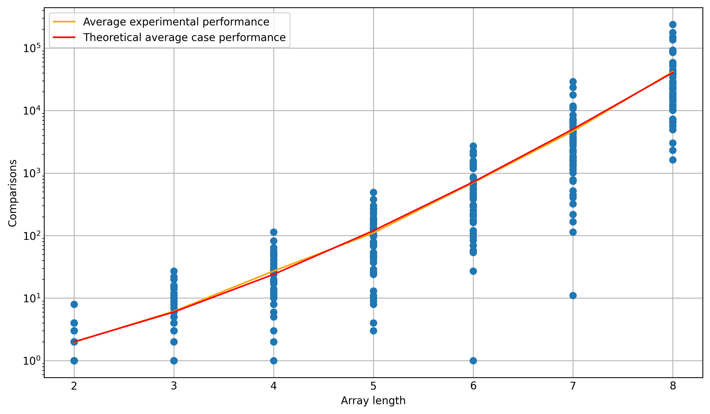

# Bogo sort algorithm effectiveness visualiser

## Overview

A script to experimentally visualise the amount of comparisons needed to sort an integer array of varying lengths with the [bogo sort](https://en.wikipedia.org/wiki/Bogosort) algorithm. The bogo sort algorithm randomly permutates an array until it is sorted and is an extremely inefficient algorithm.

## Output

## Run

Run each of the cells in `bogo.ipynb`

## Acknoledgements

Created by Nasser Kessas

## Contributing

PRs accepted, feel free to dive in! [Open an issue](https://github.com/nasserkessas/bogo-sort/issues/new) or submit PRs.

Bogo sort follows the [Contributor Covenant](http://contributor-covenant.org/version/1/3/0/) Code of Conduct.
